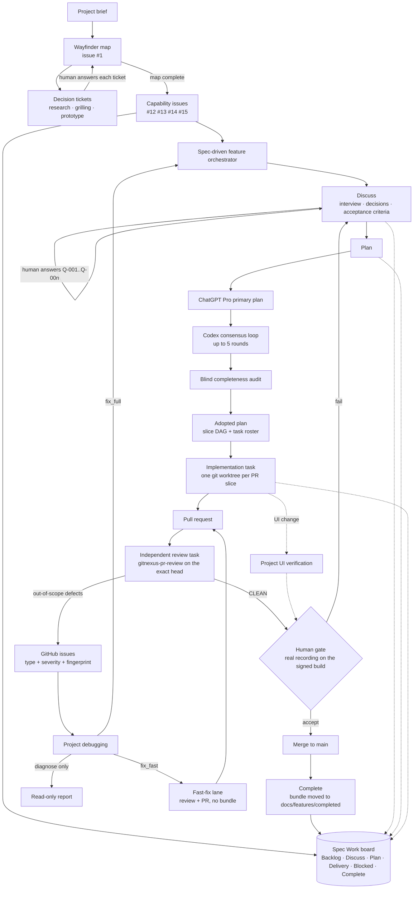

# Workflow Step Editor

A Tauri v2 desktop application that records desktop workflow steps from real
clicks and key presses, then lets you review, edit, name, and manage the
recordings.

## Features

- **Live recording.** One Record button captures clicks and key presses
  across every application. Each captured event becomes a step that
  streams into the step list while you work, with a classification dot,
  an auto-generated title, and the event time. A prominent Stop
  Recording banner is the only action while recording. Interactions
  with the recorder's own window, including the Stop click itself, are
  excluded from the captured steps.
- **Draft review and save.** Stopping opens the full editor in draft
  mode. Review the captured steps, then click **Save…** and enter a name
  (the dialog pre-selects the default timestamp name), or click
  **Discard** and confirm. Events and screenshots are already on disk when
  you stop. Naming finishes the save.
- **Step editor.** A compact step list beside a detail pane that keeps
  all three screenshots visible: one large, two labeled click-to-swap
  thumbnails (full screen, window crop, element crop). Click steps are
  cut from a pre-event frame, so the screen shows the state *before* the
  click. Typing steps use the first frame after the key that shows a
  change inside the focused element, so the just-typed character is
  normally visible; else the newest frame within 250 ms; else the
  pre-event frame.
  Edit titles and descriptions, switch the classification
  (`click`/`type`/`wait`/`assert`), and delete steps. Edits save
  automatically.
- **Workflow library.** The landing page lists saved workflows
  (thumbnail, name, `date · step count · duration`, newest first) with
  **⌘ Reveal** (reveal in Finder) on hover, rename in the detail header,
  and hard deletion behind a destructive confirmation.
- **Permission-gated.** A header strip shows the three required macOS
  permissions; recording stays disabled until all three are granted.
- **Local-only.** Recordings live under
  `~/Library/Application Support/com.dpearson.workflow-step-editor/workflows/`
  as plain JSON plus PNG screenshots. No external services.

## Quick start (build and run from a fresh clone)

The repository contains source only. There is no prebuilt app; the
`src-tauri/target/` build output is gitignored. Build it once with the
standard Tauri commands, then open the `.app` it produces.

### Requirements

- macOS 14 (Sonoma) or newer. The app is macOS-only: the capture backend
  uses CGEventTap, ScreenCaptureKit, and the Accessibility API.
- Xcode Command Line Tools. Install them with `xcode-select --install`.
- Rust (stable) with Cargo. Install it with [rustup](https://rustup.rs).
- Node.js 22.22 or later, 24.15 or later, or 26 or later, with npm (the
  jsdom test harness sets this floor). Install it from
  [nodejs.org](https://nodejs.org) or with `brew install node`.

### Install and build

```sh
git clone https://github.com/dpearson2699/workflow-step-editor.git
cd workflow-step-editor
npm install
npm run tauri build
```

The first build compiles every Rust dependency and takes several minutes.
Later builds are incremental. The app lands at:

```
src-tauri/target/release/bundle/macos/workflow-step-editor.app
```

### Open the app

```sh
open src-tauri/target/release/bundle/macos/workflow-step-editor.app
```

Or double-click it in Finder. It opens on the workflow list.

### Grant the three permissions

The header strip shows three pills: Input Monitoring, Accessibility, Screen
Recording. Click each red pill in that order and approve the System
Settings prompt. If macOS asks you to quit and reopen the app after a grant,
do so. Recording is enabled when all three pills are green. See
[Permissions](#permissions) for why the order matters.

### Record a workflow

Click **● Record New Workflow**, do something in another app (click around,
type a few characters), then click **■ Stop Recording** and review the
steps. For the full flow, see [Usage](#usage).

### Optional: run in development mode

To run the app against the Vite dev server with hot reload:

```sh
npm run tauri dev
```

macOS binds permission grants to the binary, so the dev build may ask for
the three permissions again and can lose them on rebuild. For a normal
review, use the built `.app` from [Install and build](#install-and-build).

## Tests

```sh
npm test                       # frontend component tests (vitest + jsdom)
(cd src-tauri && cargo test)   # backend tests
```

## Optional: sign the build

`npm run tauri build` works without any certificate; the app is then
unsigned and runs locally. Signing is optional and only affects how macOS
remembers permission grants across rebuilds.

If you have an Apple Development identity, set it before building:

```sh
export APPLE_SIGNING_IDENTITY="Apple Development: Your Name (TEAMID)"
npm run tauri build
```

A stable identity plus the fixed bundle identifier
(`com.dpearson.workflow-step-editor`) keeps macOS Transparency, Consent, and
Control (TCC) permission grants across rebuilds. Without it, expect to
re-grant permissions after some rebuilds.

## Permissions

The recorder needs three macOS permissions: Input Monitoring, Accessibility,
and Screen Recording. Input Monitoring must be requested first: an early
Accessibility check suppresses the Input Monitoring prompt. The backend
enforces this order and reports an out-of-order Accessibility request as
`blocked_by_prerequisite`.

Grant them from the header strip: click each red pill in order and approve
the System Settings prompt. Run the built, signed `.app` (not the dev
binary) when you want grants to persist across rebuilds; macOS ties them
to the signed bundle identity.

## Usage

1. Launch the app. It opens on the workflow list with the permission
   strip in the header. Grant any missing permission; the Record button
   enables when all three pass.
2. Click **● Record New Workflow**. The live capture view opens with the
   red **■ Stop Recording** banner. Work through the flow you want to
   record, clicking and typing in any application. Each click and key press
   appears as a step row while you work.
3. Click **■ Stop Recording**. The editor opens in draft review with a
   `draft` badge. Select steps to check their screenshots and metadata,
   edit titles or classifications, and delete noise steps.
4. Click **Save…**, type a name over the pre-selected timestamp default,
   and save. Or click **Discard** and confirm to delete the recording's
   folder. If a recording fails mid-way (for example a revoked
   permission), the committed steps still open in draft review behind an
   error banner.
5. From the landing list, click a row to reopen a workflow. Edit titles,
   descriptions, and classifications (they save automatically), rename
   the workflow in the header, hover a row for **⌘ Reveal** in Finder,
   or use **Delete…** in the detail header to remove a workflow and all
   its captured data.

## Limitations

- macOS-only. Other platforms are out of scope.
- Window crop caveat: the window-crop screenshot is a crop of the full-screen
  frame at the window's bounds, not an isolated image of the window. Content
  overlapping those bounds appears in the crop.
- Known open defects are tracked on GitHub. See [Known issues](#known-issues).

## Walkthrough

- Video: [Workflow Step Editor walkthrough](https://youtu.be/d9cNUFqyCsU) (2:41, unlisted on YouTube).
- Written: [docs/walkthrough/WALKTHROUGH.md](docs/walkthrough/WALKTHROUGH.md)
  follows the video and carries the points that do not fit on screen.

## Scope: completed and removed

Against the brief in [`docs/PROJECT_GOAL.md`](docs/PROJECT_GOAL.md):

| Requirement | Status | Where |
| --- | --- | --- |
| Tauri desktop application (Rust backend) | Done | `src-tauri/`, React + Vite frontend in `src/` |
| Frontend button that starts recording | Done | **● Record New Workflow** on the landing page |
| Rust backend monitors clicks and keyboard entries | Done | ListenOnly `CGEventTap` on a dedicated run-loop thread (`src-tauri/src/capture/tap.rs`) |
| Three screenshots per event: full screen, window crop, element crop | Done | Continuous ScreenCaptureKit stream per display, pre-buffered frames (`src-tauri/src/capture/`, architecture decision record [ADR-0001](docs/adr/0001-pre-buffered-screen-capture.md)) |
| Parse captured actions into understandable steps | Done (1:1) | Each event becomes one step at capture time with an auto-title such as `Click "Save" — TextEdit` or `Press Cmd+S — TextEdit` (`src-tauri/src/domain/parser.rs`) |
| Text titles and descriptions per step | Done | Detail pane, autosaved |
| Classify each step as `click`, `type`, `wait`, or `assert` | Done | Auto-classified `click`/`type`; the user can switch any step to `wait` or `assert` |
| Group related text input into one action | Removed | Issue [#14](https://github.com/dpearson2699/workflow-step-editor/issues/14). The lossless `events.jsonl` log and the `KeySemantics` classifier (ADR-0002) keep it possible without a schema change |
| Keyboard shortcuts | Removed (partial) | Issue [#15](https://github.com/dpearson2699/workflow-step-editor/issues/15). Chords are captured and titled (`Press Cmd+S`) but not presented as a distinct step kind |

Also removed from scope, on purpose:

- Automatic `wait` or `assert` detection and any re-parse of the event log
  after capture (steps are produced live, 1:1).
- SQLite. Schema v1 is JSON behind one `WorkflowStore` trait, so SQLite can
  replace it later without touching the capture path.
- Trash, restore, or audit for deleted workflows (ADR-0003: confirmed hard
  delete).
- Cross-platform capture. Every capture primitive is macOS-specific.

## Key technical decisions and tradeoffs

The durable record is the three ADRs in [`docs/adr/`](docs/adr/) and the
`DECISIONS.md` file inside each work bundle under
[`docs/features/completed/`](docs/features/completed/). The short version:

- **Pre-buffered capture instead of capture on demand.** A screenshot
  taken after a click can miss the menu or the page that the click closed.
  So the app runs one ScreenCaptureKit stream per display, at about 10
  frames per second (fps), and keeps the two newest frames in memory; a
  click uses the newest frame that precedes the event
  ([ADR-0001](docs/adr/0001-pre-buffered-screen-capture.md)). Cost: a
  standing capture stream while recording, and a window crop that is a
  bounds crop of the display frame.
- **Per-kind frame timing.** The pre-event frame is useless for typing: it
  shows the field before the character. Key-down steps select the first
  frame within 250 ms whose pixels inside the focused element differ from
  the pre-event frame. Clicks
  keep the pre-event rule byte-for-byte. Accepted tradeoff: the very first
  keystroke of a recording can still show the pre-glyph frame (issue
  [#43](https://github.com/dpearson2699/workflow-step-editor/issues/43)).
  See the ADR-0001 amendment and issue
  [#38](https://github.com/dpearson2699/workflow-step-editor/issues/38).
- **The tap never blocks.** All metadata resolution, frame selection, PNG
  encoding, and disk writes run on one first-in, first-out (FIFO) worker
  behind a bounded queue. If the queue saturates, the recording fail-stops with an explicit error
  rather than dropping events silently (foundation DEC-009).
- **Ordered permission requests.** macOS suppresses the Input Monitoring
  prompt if Accessibility is checked first, so the backend enforces the
  order and reports `blocked_by_prerequisite`. A stable signing identity and
  bundle id keep TCC grants across rebuilds.
- **Lossless events under editable steps.** Capture appends `events.jsonl`
  and PNGs; the editable manifest `workflow.json` references events by ID.
  Data on disk survives a stop or a fail-stop; only an explicit **Discard**
  or **Delete…** removes it (foundation DEC-002).
- **Live 1:1 parsing, no synthetic steps.** Every event is one step,
  streamed to the UI as soon as it's committed. Grouping and detection were
  deferred to stay inside the minimum viable product (MVP); see foundation
  DEC-003.
- **`KeySemantics` classifier in the core.** Chord detection uses modifier
  state, never timing, and its verdicts are never persisted, so both stretch
  capabilities can share one boundary rule later
  ([ADR-0002](docs/adr/0002-key-event-semantic-classifier.md)).
- **Draft is a UI state, not a storage state.** Stopping writes everything;
  the naming dialog only renames. A crash between Stop and Save loses
  nothing (review-UI DEC-005).
- **Confirmed hard delete.** Delete removes the workflow folder after a
  confirmation; there is no trash lifecycle
  ([ADR-0003](docs/adr/0003-hard-delete-for-saved-workflows.md)).

## Known issues

Open defects live in the
[issue tracker](https://github.com/dpearson2699/workflow-step-editor/issues?q=is%3Aissue+is%3Aopen+label%3Abug).
Every one came out of a pull request (PR) review or a gate run, and none
is reachable on the normal record → stop → review → save path. The ones
worth knowing before a demo:

- [#21](https://github.com/dpearson2699/workflow-step-editor/issues/21)
  (P2): the manifest is written at stop or fail-stop only. A force-quit or
  crash during a recording leaves `events.jsonl` and the screenshots on disk
  but an empty step list.
- [#24](https://github.com/dpearson2699/workflow-step-editor/issues/24)
  (P2): plugging or unplugging a display during a recording does not restart
  the capture streams (the reconfiguration observer is inert).
- [#20](https://github.com/dpearson2699/workflow-step-editor/issues/20)
  (P2): three of its five findings are already fixed; the panic-unwind latch
  and the restart-after-failure window remain.
- [#43](https://github.com/dpearson2699/workflow-step-editor/issues/43),
  [#42](https://github.com/dpearson2699/workflow-step-editor/issues/42):
  key-down timing residuals accepted as tradeoffs (see
  [Key technical decisions and tradeoffs](#key-technical-decisions-and-tradeoffs)).
- The rest are P3 races with microsecond windows, cosmetic naming
  ([#27](https://github.com/dpearson2699/workflow-step-editor/issues/27)),
  and metadata edge cases.

## What would follow with more time

1. Incremental manifest persistence (#21) and the remaining #20 hardening.
2. Text-input grouping (#14) and keyboard-shortcut presentation (#15) on top
   of `KeySemantics`.
3. A working display-reconfiguration signal (#24) and the run-loop handshake
   fix (#29).
4. Automatic `wait` detection from event gaps, and `assert` suggestions from
   window or element changes.
5. Export of a workflow as a runnable script or a shareable document.

## How this was built: AI tools and workflow

### The four-hour limit

The brief says four hours. I read that as four hours of my own time, not
four hours of agent time. My time at the keyboard stayed inside that. The
agents ran a lot longer, in parallel worktrees, across three calendar days
(2026-08-16 to 2026-08-18).

I didn't prompt an assistant line by line. I built and ran an agent harness
that lives in this repo under [`.agents/`](.agents/), and I worked above it:
I set up the map, answered the decision questions, read the plans and the
pull requests, ran the acceptance recordings on the signed build, and made
the product and architecture calls. The agents did the research, the specs,
the code, the review, and the issue filing. The full picture, with a
diagram, is in the [appendix](#appendix-the-agentic-engineering-harness).

### Tools

| Tool | Role |
| --- | --- |
| Claude Code (Fable 5) | Root orchestrator and implementer. Ran the harness under [`.agents/`](.agents/): the wayfinder map, the spec-driven feature orchestrator, the debugging route, and UI verification. Implementation and review of every PR ran as separate worktree tasks; the implementer never reviewed its own PR. |
| ChatGPT Pro (through [`chatgpt-pro-feature-planner`](.agents/skills/chatgpt-pro-feature-planner/SKILL.md)) | Wrote the primary plan for each capability. Every consultation is captured verbatim under `docs/features/completed/*/discovery/pro-lifecycle-evidence/` and linked from the ADRs. |
| Codex CLI (`gpt-5.6-sol`, read-only sandbox) | Consensus counterparty. Each plan went through up to five adversarial rounds before adoption; the logs are `docs/features/completed/*/review/plan-consensus-log.md`. Codex also did a second-opinion pass on some PRs. |
| GitNexus | Code graph for impact analysis during implementation, and the `gitnexus-pr-review` skill for exact-head PR review. It also filed the follow-up issues under [`.github/issue-label-policy.json`](.github/issue-label-policy.json). |
| MuninnDB | Project memory across sessions (decisions, preferences, lessons). |
| GitHub Projects | The Spec Work board that every bundle and issue projects onto. |

### How the work ran

Three passes, each on the same loop.

1. A wayfinder map ([#1](https://github.com/dpearson2699/workflow-step-editor/issues/1))
   turned the brief into decision tickets. Four research tickets
   ([#2](https://github.com/dpearson2699/workflow-step-editor/issues/2) to
   [#5](https://github.com/dpearson2699/workflow-step-editor/issues/5))
   checked the capture, screenshot, accessibility, and scaffold questions
   against the real macOS APIs before any code. Five grilling tickets
   ([#6](https://github.com/dpearson2699/workflow-step-editor/issues/6),
   [#7](https://github.com/dpearson2699/workflow-step-editor/issues/7),
   [#9](https://github.com/dpearson2699/workflow-step-editor/issues/9),
   [#10](https://github.com/dpearson2699/workflow-step-editor/issues/10),
   [#11](https://github.com/dpearson2699/workflow-step-editor/issues/11))
   pinned the architecture, storage schema, parsing, stretch boundary, and
   capability split. One prototype ticket
   ([#8](https://github.com/dpearson2699/workflow-step-editor/issues/8),
   branch `prototype/map-1-8`) gave me UI variants to pick from; I took
   variant D. The map then minted the capability backlog:
   [#12](https://github.com/dpearson2699/workflow-step-editor/issues/12)
   capture foundation,
   [#13](https://github.com/dpearson2699/workflow-step-editor/issues/13)
   review UI, [#14](https://github.com/dpearson2699/workflow-step-editor/issues/14)
   and [#15](https://github.com/dpearson2699/workflow-step-editor/issues/15)
   stretch.
2. Each capability then went through the spec-driven feature orchestrator:
   interview, ChatGPT Pro primary plan, Codex consensus loop, blind
   completeness audit, adopted plan, one worktree task per PR slice,
   independent exact-head review, merge. The bundles are
   [`2026-08-17-capture-pipeline-and-backend-foundation`](docs/features/completed/2026-08-17-capture-pipeline-and-backend-foundation/)
   (PRs [#17](https://github.com/dpearson2699/workflow-step-editor/pull/17),
   [#19](https://github.com/dpearson2699/workflow-step-editor/pull/19),
   [#23](https://github.com/dpearson2699/workflow-step-editor/pull/23)),
   [`2026-08-17-review-ui`](docs/features/completed/2026-08-17-review-ui/)
   (PRs [#30](https://github.com/dpearson2699/workflow-step-editor/pull/30),
   [#31](https://github.com/dpearson2699/workflow-step-editor/pull/31),
   [#36](https://github.com/dpearson2699/workflow-step-editor/pull/36)),
   and the key-down timing bundle on branch
   `claude/spec-driven-orchestrator-issue-38-072a42`
   (PR [#39](https://github.com/dpearson2699/workflow-step-editor/pull/39)
   closed unmerged, PR [#41](https://github.com/dpearson2699/workflow-step-editor/pull/41)
   merged).
3. Each capability ended with me running a real recording on the signed
   build and looking at what came out: the foundation's proven gate
   (`review/proven-gate-run.md`), the review UI's final design gate, and
   three timing gate runs for #38 (`review/timing-gate-run.md` on the bundle
   branch). Nothing merged until I'd run it.

### Where AI sped things up

The macOS capture research. Tickets #2 to #5 worked out, against the real
APIs and crates, that a ListenOnly `CGEventTap` on its own run loop, a
continuous `SCStream` per display, and accessibility (AX) hit-testing at the
click point were the right primitives. Ticket #2 also caught the TCC
prompt-order trap: check Accessibility first and macOS never shows the Input
Monitoring prompt. With that settled, the first capability went from adopted
plan to a passing real recording in one day (three PRs merged on
2026-08-17): the ordered permission commands, the frame broker, the bounded
queue, and the fake-driven coordinator tests, all through the same review
path.

### Where AI got it wrong

Key-down screenshot timing (issue #38). ChatGPT Pro planned a rule that took
the oldest frame after the key. Codex agreed over five consensus rounds and
the blind audit passed it. On the first real recording it captured the
window title's dirty-state repaint instead of the typed character. The
second proposal, a 100 ms settle then the newest frame, passed the same
checks and failed the next recording: at typing speed it showed characters
typed after the step. I caught both in the recordings ("Hel" showing up on
the `e` step), and that pointed at the content-aware rule that shipped.
Three gate runs, two failed, one accepted with a stated tradeoff. The unit
tests passed all three times. Two of the rules only broke once I actually
typed in the app.

Second case: the display-reconfiguration observer
([#24](https://github.com/dpearson2699/workflow-step-editor/issues/24)).
An agent wrote it and unit-tested it against a fake backend. The review of
that same PR ran a small Swift probe and showed that
`CGDisplayRegisterReconfigurationCallback` installs no run-loop source, so
the observer thread exited right away and the callback never ran. I filed it
as a follow-up instead of blocking the PR, because recordings on a static
display aren't affected.

### What worked and what didn't

Adversarial planning worked. Pro plus Codex plus a blind completeness audit
removed most of the defects before any code existed, and the consensus logs
show why each disputed point went the way it did.

Separate review with issue-filing authority worked. Every open bug issue
came out of a review or a gate run with a reproduction, a fingerprint, and a
severity.

The human gate as a merge blocker worked. When the automated proof was thin,
I ran a real recording and went with what it showed.

Time-based heuristics without a real run didn't work; see the #38 case in
[Where AI got it wrong](#where-ai-got-it-wrong).

The harness's own state machine didn't hold up at the edges. A failed human
gate on a single-slice final PR had no modeled recovery
([#40](https://github.com/dpearson2699/workflow-step-editor/issues/40)),
and a review-lease path deadlocked against its own lock
([#18](https://github.com/dpearson2699/workflow-step-editor/issues/18)).
Both cost time, and both are filed as harness issues.

Planning depth against the clock didn't work near the end. Five-round
consensus loops are thorough, and at some point I had to say "no more
rounds" and ship.

### How AI supported each phase

- Planning: wayfinder grilling tickets and interviews produced the
  decisions in `docs/features/*/DECISIONS.md` and the ADRs; ChatGPT Pro
  wrote each primary plan; Codex challenged it.
- Research: the research tickets (#2 to #5) and the UI prototype (#8).
- Implementation: Claude Code worktree tasks per PR slice, red-green with
  deterministic fakes (fake capture pipeline, injected wait runtime, fixed
  clocks).
- Review: `gitnexus-pr-review` on the exact head, a Codex second opinion,
  and my own PR reads and gate runs.

### Where the prompts are

The brief suggests a `/prompts` folder or an appendix. The prompts in this
project aren't chat one-liners; they're the harness itself. The skill and
workflow definitions the agents ran are committed under
[`.agents/`](.agents/), and the verbatim record of every planning
conversation, consensus round, interview answer, and gate verdict is under
`docs/features/completed/*/`. [`prompts/README.md`](prompts/README.md) maps
each human control point to the file that holds it, and the appendix below
explains how the pieces fit together.

## Appendix: the agentic engineering harness

This is the part of the project I'd most like a reviewer to look at. The
app is the deliverable; the harness is how one person shipped it inside
four hours of their own time with an auditable record of every decision.

### What it is

A set of skills and one shared workflow, all plain Markdown plus a few
deterministic scripts, checked into [`.agents/`](.agents/):

| Piece | Path | What it owns |
| --- | --- | --- |
| Wayfinder | [`.agents/skills/wayfinder/`](.agents/skills/wayfinder/) | Turns a loose brief into a map of decision tickets on GitHub (research, grilling, prototype, task). Planning only. At map completion it mints one backlog issue per cleared capability. |
| Spec-driven feature orchestrator | [`.agents/skills/spec-driven-feature-orchestrator/`](.agents/skills/spec-driven-feature-orchestrator/) | Entry point for a capability or a full bug fix. Classifies the request and hands it to the shared workflow. |
| Spec-work workflow (core) | [`.agents/workflows/spec-work-orchestrator/CORE.md`](.agents/workflows/spec-work-orchestrator/CORE.md) | The lifecycle: Discuss → Plan → Delivery → Complete. Keeps its state in a per-bundle `state.json` that only its scripts may write. |
| ChatGPT Pro feature planner | [`.agents/skills/chatgpt-pro-feature-planner/`](.agents/skills/chatgpt-pro-feature-planner/) | Sends the checkpointed spec to ChatGPT Pro, captures the response verbatim, and hands it back as an immutable planning artifact. |
| Project debugging | [`.agents/skills/project-debugging/`](.agents/skills/project-debugging/) | Root-cause evidence first, then a route: diagnosis only, a fast-fix lane, or a full spec-work bundle. |
| Project UI verification | [`.agents/skills/project-ui-verification/`](.agents/skills/project-ui-verification/) | Owns any user-visible proof a route needs, including the human design gate. |
| Issue label policy | [`.github/issue-label-policy.json`](.github/issue-label-policy.json) | One issue type, one severity, and a fingerprint per defect so agents find and reuse the exact owning issue instead of filing duplicates. |
| Project guide | [`AGENTS.md`](AGENTS.md) | Project facts and routing: which skill owns which kind of request. |

### How the pieces connect



Solid arrows are the work path. Dotted arrows are the oversight path: the
board is a projection of each bundle's state, never the authority.

### How a capability actually moved through it

Take issue [#38](https://github.com/dpearson2699/workflow-step-editor/issues/38),
the key-down screenshot timing change, because it exercised every branch:

1. I typed `/spec-driven-feature-orchestrator issue 38`.
2. Discuss asked two questions (how a key-down picks its frame, and what
   proves acceptance). I answered both; the answers are DEC-001 to DEC-003
   in the bundle's `DECISIONS.md`.
3. Plan checkpointed the spec, sent it to ChatGPT Pro, ran five Codex
   consensus rounds, and passed a blind completeness audit. The plan was
   adopted with one slice, PR-01.
4. An implementation task built PR-01 in its own worktree. A separate
   review task reviewed the exact head and returned CLEAN.
5. I ran the human gate: built the signed app, recorded myself typing, and
   looked at the screenshots. The first keystroke showed the wrong frame.
   Gate failed. Back to Discuss (Q-003, Q-004).
6. The replacement rule went through the loop again as PR-02, with the Pro
   round waived (DEC-005) and one more Codex round. The second gate failed
   differently. Back to Discuss (Q-005).
7. The third rule passed the gate with one tradeoff I accepted, recorded as
   issue [#43](https://github.com/dpearson2699/workflow-step-editor/issues/43).
   PR [#41](https://github.com/dpearson2699/workflow-step-editor/pull/41)
   merged and issue #38 closed. The bundle record itself stayed blocked,
   which is the next paragraph.

The harness itself broke once along the way: a failed human gate on a
single-slice final PR had no modeled recovery, so the bundle could merge
the fix but couldn't mark itself complete. That's issue
[#40](https://github.com/dpearson2699/workflow-step-editor/issues/40),
labeled `harness`, and it's the kind of thing the policy exists to catch:
the agent filed it against the harness the same way it files bugs against
the app.

### Governance rules that held

- One authority per concern. The bundle's `state.json` owns lifecycle
  state; only the `work-state` script writes it. GitHub is the system of
  record for issues and PRs. The board is a view.
- No self-review. The task that wrote a PR never reviewed it.
- No merge without a human. Every capability ended in a real recording
  that I ran; the merge waited for my verdict.
- Every defect gets an owner. A reviewer that finds an out-of-scope bug
  computes a fingerprint from the failed invariant and the affected
  surfaces, searches open and closed issues for it, and either reuses the
  one open owner or files one issue with the marker, a type, and a
  severity. That's why every open bug issue is traceable to a PR or a gate
  run.
- Small reversible slices. Each PR is one vertical slice with its own plan,
  acceptance coverage, and worktree.
- Evidence over prose. Decisions, interviews, Pro responses, consensus
  rounds, review receipts, and gate runs are files in the repo, not claims
  in a chat.

### What I'd change

The harness is heavier than a four-hour take-home needs. Five consensus
rounds per plan and a blind audit on every change are right for a codebase
that has to last; near the end I overrode them to ship. The state machine
also needs the recovery path #40 describes. Both are on the list.
